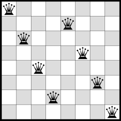

## `N 皇后问题`

* 在 N\*N 的棋盘上有 N 个皇后，求一个解，让皇后不互相攻击
  

- 思路：

  * 1.用数学知识可以得出的总的排列方式有 C(N2)N 种方式

  ```
  let factorial=(n)=>{
      if(n=1){
          return 1
      }
      if(n<=0){
          console.log('不合法')
      }
      return n*factorial(n-1)
  }
  let sum = factorial(n*n)/factorial(n)/factorial(n*(n-1))
  ```

  * 2.筛选出 1 中的前后左右对角线上没有其他皇后的组合就是最后的结果
